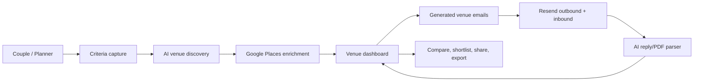

# Aisle

AI-powered wedding venue search and outreach.

Aisle helps couples turn a vague wedding brief into a managed venue pipeline: capture criteria, discover matching venues, generate inquiry emails, parse venue replies and brochures, compare options, and share shortlists.

Live demo: https://aisle-xi.vercel.app

## The Problem

Wedding venue search is still a manual operations problem. Couples bounce between marketplaces, venue websites, PDFs, email threads, spreadsheets, and family WhatsApp debates. The hard part is not finding a list of venues; it is coordinating the back-and-forth until the real options are clear.

Aisle focuses on the communication and decision layer:

- Convert text, voice, and visual inspiration into structured criteria
- Find venues that match hard requirements and rank by preferences
- Generate personalized venue emails
- Track replies, missing information, notes, and follow-ups
- Compare venues side by side
- Share lists with a partner, family member, or planner

## Product Highlights

| Area | What is built |
| --- | --- |
| Criteria capture | Text, voice transcription, and image-vibe analysis |
| Venue discovery | AI search plus Google Places enrichment for addresses, ratings, websites, and photos |
| Smart ranking | Hard criteria filtering and soft preference scoring |
| Email workflow | Batch inquiry generation, review, send flow, and follow-up generation |
| Reply handling | Resend inbound webhook, AI summary extraction, reply history, and missing-info updates |
| Venue workspace | Dashboard, venue detail pages, notes, call transcripts, status tracking, and editable contact data |
| Comparison | 2-3 venue side-by-side comparison with value highlights |
| Lists and sharing | Custom lists, email sharing, and Excel export |
| Auth and persistence | Supabase auth and per-user venue/criteria storage |

## How It Works



## Tech Stack

| Layer | Technology |
| --- | --- |
| App | Next.js 16, React 19, TypeScript |
| Styling | Tailwind CSS, shadcn/Radix UI primitives, lucide-react |
| Auth and data | Supabase Auth, PostgreSQL, RLS |
| AI | OpenAI for criteria parsing, venue discovery, image analysis, email generation, and reply extraction |
| Venue data | Google Places API |
| Email | Resend outbound email and inbound webhook processing |
| Export | `xlsx` for venue list downloads |
| Hosting | Vercel |

## Repository Structure

```text
aisle/
|-- app/                    # Next.js routes and API handlers
|   |-- api/                # AI, email, venue, webhook, and parsing routes
|   |-- criteria/           # Criteria capture and recap flow
|   |-- venues/             # Venue dashboard, details, status, booking flows
|   `-- dashboard/          # Main workspace
|-- components/             # Product UI components
|-- components/ui/          # Shared UI primitives
|-- lib/                    # AI, email, Supabase, matching, types, exports
|-- hooks/                  # Client hooks
|-- public/samples/         # Demo assets
`-- supabase/schema.sql     # Local database bootstrap
```

## Getting Started

### Prerequisites

- Node.js 20+
- Supabase project
- OpenAI API key
- Resend API key
- Google Places API key

### Setup

```bash
git clone https://github.com/saurabhbains/aisle.git
cd aisle
npm install
cp .env.example .env.local
npm run dev
```

Then run the SQL in `supabase/schema.sql` inside the Supabase SQL editor.

The app starts on `http://localhost:3000`.

### Environment Variables

```env
NEXT_PUBLIC_SUPABASE_URL=your_supabase_url
NEXT_PUBLIC_SUPABASE_PUBLISHABLE_KEY=your_supabase_publishable_key
SUPABASE_SECRET_KEY=your_supabase_service_role_key
OPENAI_API_KEY=your_openai_key
RESEND_API_KEY=your_resend_key
GOOGLE_PLACES_API_KEY=your_google_places_key
EMAIL_FROM=noreply@yourdomain.com
```

## Demo Notes

The repository contains both production-shaped flows and demo-safe paths:

- Batch email send can run in demo mode to avoid contacting real venues accidentally.
- The sample PDF flow includes realistic fallback data for reliable demos.
- Venue discovery can fall back to mock venue data when no external search results are provided.

These choices make the project easy to demo while keeping the architecture pointed toward a real product.

## Production Readiness Notes

Before treating this as production software, the next hardening steps are:

- Verify Resend webhook signatures before processing inbound email
- Move venue storage from large JSON blobs into relational tables
- Replace demo PDF fallback with robust PDF text extraction and structured evals
- Add background jobs for long-running venue search and reply parsing
- Add tests around criteria parsing, ranking, email generation, and webhook updates
- Add billing/subscription flow and account sharing for couples

## Roadmap

- [x] Voice, text, and image criteria capture
- [x] AI venue discovery and Google Places enrichment
- [x] Venue dashboard and detail pages
- [x] Batch email generation and sending
- [x] Inbound reply parsing and reply history
- [x] Custom lists, sharing, and Excel export
- [x] Side-by-side comparison
- [x] Per-user auth and persistence
- [ ] Joint couple accounts
- [ ] Calendar integration for visits
- [ ] Background job queue for scraping and parsing
- [ ] Payment/subscription flow
- [ ] Production webhook verification and observability

## Built By

Saurabh Bains - product builder focused on AI workflows for high-context human decisions.
